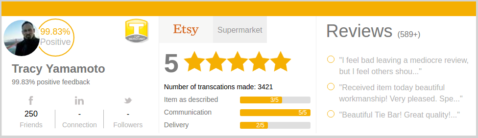

## eRated Plugin
* external plugin that display sellers online rating from multiple different sources.

### Get Started
1. After you clone run "npm install".
2. Than "npm run start"
3. Go to: http://localhost:3333/

### General
1. This implementation contain only dev ENV, I haven't build webpack configuration for production.

### Technologies - why?
* **babel** - allows to write ES6 code with classes, generators, arrow function, "spread" operator and yield code in ES5.
* **image-webpack-loader/svg-inline-loader** - allows me to import svg and other images easily to the js code.
* **react** - react is high performance way of rendering view on the client (and allows you to render components on the Backend thanks to virtual DOM).
* **redux** - redux is highly praise by the developers of "flux", it's easy to understand and provides high scalability thanks to stuff like combineReducers and more.
* **immutable.js** - smart way of managing immutable data, works great with redux and react.
* **webpack** - is doing stuff that others do (grunt/gulp) and much more (manage dependencies, create bundles).
* **SASS** - because if you write just CSS you're gonna have bad time!
* **redux thunk** - allows to write action that return function and delay the dispatch of an action.

### Architecture
1. Small components - Thanks to webpack 'import' and react components and redux scalability it's easy to manage and maintain the code in small portion (from media, to html and even css).
2. Folder by feature - provides high scalability and allows us to extend the product as much as we need.
3. Separation of concerns:
  1. Logic - managed inside reducers.
  2. Data - injected into store/state thanks to Redux.
  3. HTML - lives within render function inside React component.
  4. Style - written inside the component specific folder or globally and import when we need it.
  5. Dump/Smart components - dump components aren't aware of redux and they just get data from "props" which allows for easy reusability of code that isn't coupled with redux.
4. CommonJS - work with "export" to expose logic/components/data and more.
	
### Tested
1. ubuntu
  1. chrome
  2. firefox
2. mac OS
  1. chrome
  2. safari
  3. firefox

### Screenshot

